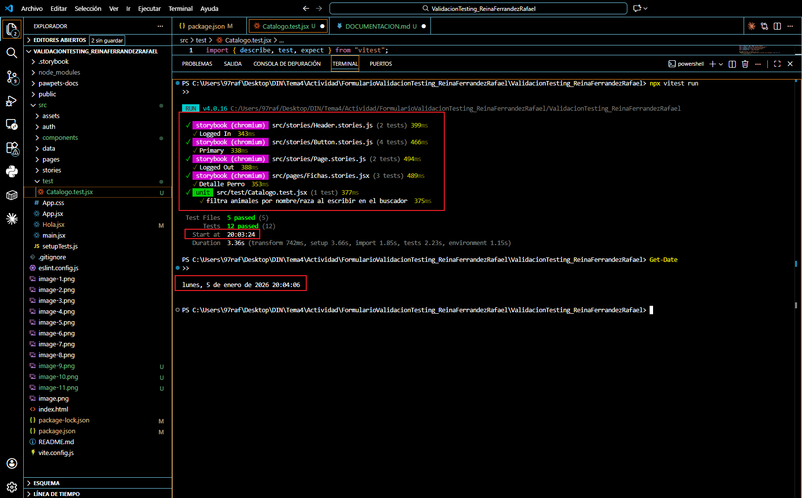
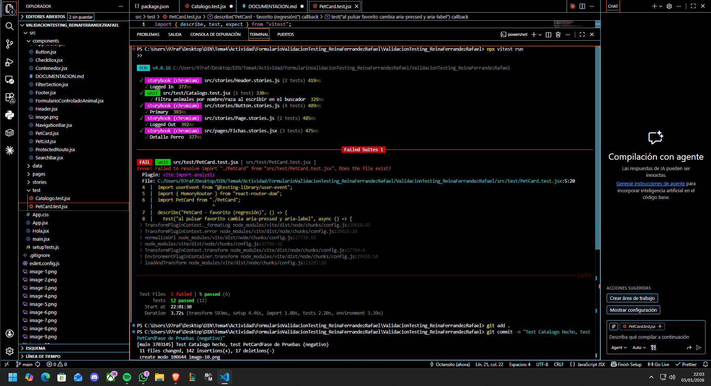
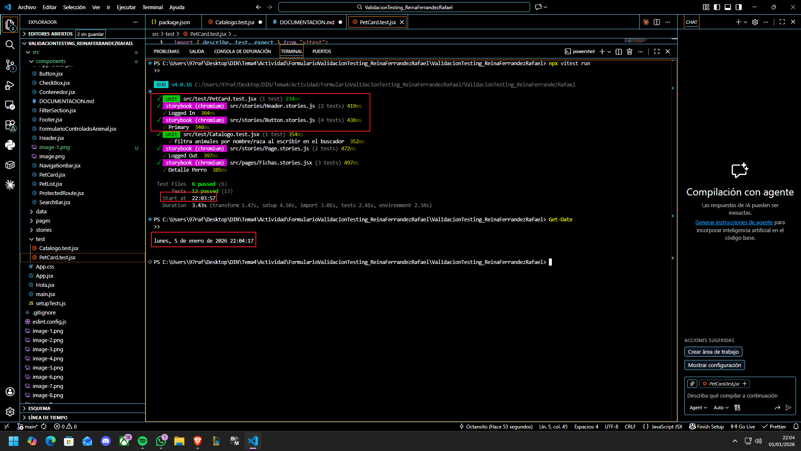

Pruebas que se van a realizar de testeo para comporbar qué hace un usuario en PAWPETS y que deberían funcionar:

#Informe de Testing - Rafael Reina Ferrández

## Actividad 1

- ** Reto: Integración: ** Comprobación de que al escribir en el buscador del catálogo se filtra correctamente la lista de animales (nombre/raza), mostrando solo los que coinciden y ocultando el resto.

- \**Prompt IA:*Actúa como profesor de testing en React. Quiero aprender a diseñar (no solo copiar) un test de integración con Vitest + React Testing Library para un catálogo que filtra una lista al escribir en un buscador.

Indícame qué debo revisar en el componente para saber si necesito wrappers como MemoryRouter o algún Provider.

Explícame cómo elegir el selector accesible correcto para el input (cuándo usar getByLabelText, getByRole o getByPlaceholderText) y qué información debo buscar en el JSX para decidirlo.

Dame un esqueleto de test siguiendo AAA (Arrange/Act/Assert) y ejemplos de 2–3 líneas clave, explicando el porqué de cada una.

Explícame la diferencia práctica entre getBy... y queryBy... y en qué caso usar cada uno.

Dime errores comunes (router, selectores que no encuentran nada, etc.) y cómo diagnosticarlos con screen.debug().\*

- **Explicación del Test:**

  - **Arrange:** Renderizo `<Catalogo />` envuelto en `MemoryRouter` porque el catálogo usa componentes con `Link` (react-router). Localizo el input del buscador con un selector accesible.
  - **Act:** Simulo que el usuario escribe con `userEvent.type(...)` para disparar una simulación de escritura.
  - **Assert:** Verifico que el animal que coincide aparece (con `getByText` o `getByRole`) y que otro animal no aparece usando `queryBy...`.
  - **Selector destacado:**
  - `getByPlaceholderText(/Buscar por nombre, raza.../i)` se usa porque el buscador tiene `placeholder`.
  - `queryBy...` se usa para comprobar ausencia.

Captura de pantalla:

## Actividad 2

- **Reto: Regresión: ** Comprobación de que el botón de favorito en una tarjeta cambia su estado al pulsarlo: cambia `aria-pressed` y el texto accesible (`aria-label`) de “Marcar como favorito” a “Quitar de favoritos”.

- \*Prompt IA: Actúa como profesor. No quiero que me lo hagas sin explicar ni quiero copiar y pegar: quiero aprender a diseñar el test.
  Guíame paso a paso para testear un botón ‘Favorito’ en React con Vitest + React Testing Library siguiendo AAA.

Dime qué tengo que mirar en el componente para decidir qué wrappers necesito (Router, Providers).

Dime qué atributos/elementos debo buscar para elegir el selector correcto (role, aria-label, aria-pressed).

Explícame qué interacción simulo y por qué conviene usar userEvent.setup().

Explícame qué asserts son los adecuados (estado inicial y estado final) y por qué.

Dame una estructura de test (esqueleto) y ejemplos de líneas clave, pero con explicación del porqué.\*

- **Explicación del Test:**

  **Arrange:** Renderizo `<PetCard />` con `MemoryRouter` (usa `Link`). Localizo el botón favorito con `getByRole("button", { name: /  Marcar como favorito/i })` porque el componente define `aria-label`.

  - **Act:** Simulo el click del usuario con `userEvent.click(...)`.
  - **Assert:** Compruebo que `aria-pressed` cambia de `false` a `true` y que ahora el botón tiene nombre accesible “Quitar de favoritos”.
  - **Selector destacado:**
    - `getByRole("button", { name: ... })` selecciona por rol accesible + nombre accesible.

